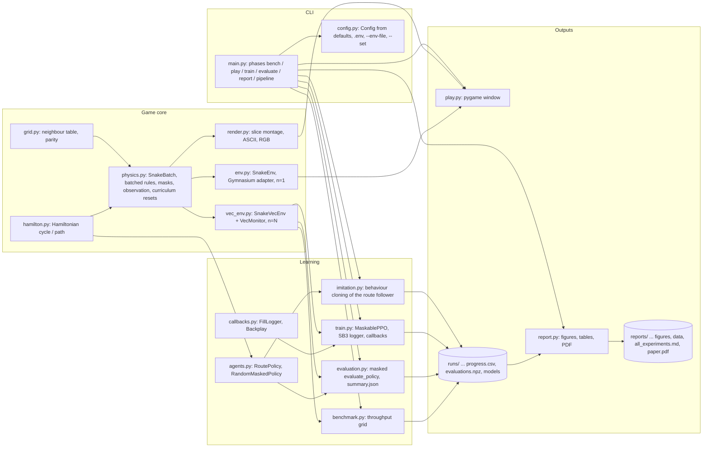

# 4D Snake + reinforcement learning

An N-dimensional snake game (default **4D**: a `4 x 4 x 4 x 4` board, 256 cells, 8 move
directions) and a **MaskablePPO** agent trained to *complete* it, i.e. grow until the snake fills
every cell. Everything runs on one Windows laptop (RTX 5070 Laptop GPU); the game is playable by a
human, the training pipeline is fully scripted, and every experiment is written up in
[reports/](reports/).

## Methodology in one page

- **Game.** `size**ndim` cells addressed by flat index; action `a` moves along axis `a >> 1`
  (+1 if `a` is even, else -1). The state is a *body-age grid* (tail = 1 ... head = length): moving
  the tail is one decrement, collisions are one lookup, and all `N` training boards are stepped
  together with vectorised numpy. Eating grows the snake by one; the board is complete when
  `length == size**ndim`. Starvation (`4 * cells` steps without food) and an absolute cap
  (`cells^2` steps) are truncations, never deaths. Rules: [docs/game_rules.md](docs/game_rules.md).
- **Agent.** sb3-contrib `MaskablePPO` with an MLP `[512, 512]` on a flat observation of
  `4 * cells + 2` floats (body, time-to-vacate, head, food, length, hunger). The environment
  supplies a legal-action mask (walls, occupied cells, the neck), so the agent only chooses
  *which* safe move fills the board. Reward: +1 food, -1 death, +10 win, -0.001 per step; no
  distance shaping. Design and hyper-parameters: [docs/rl_design.md](docs/rl_design.md).
- **Curriculum.** A Hamiltonian route (a cycle for even sizes; for odd sizes a cycle over all
  cells but one corner) is both the scripted baseline that proves every board is completable and
  the demonstration for a **Backplay** reverse curriculum: episodes start as long route segments
  near a full board and the start moves backwards as the success rate allows. Evaluation always
  starts from length 1.
- **Evaluation.** 100 episodes x 3 seeds, deterministic and stochastic passes, masked
  `evaluate_policy`; headline metrics are the completion rate, mean fill and steps to complete,
  compared with the route follower (ceiling) and masked random play (floor):
  [docs/evaluation.md](docs/evaluation.md).
- **Science loop.** Each experiment is pre-registered as an `.env` override file in
  [experiments/](experiments/) and written up (question, hypothesis, setup, results, learnings)
  in [reports/experiments/](reports/experiments/); [reports/all_experiments.md](reports/all_experiments.md)
  is the generated cross-run table and [reports/paper.md](reports/paper.md) the paper (compiled to
  `reports/paper.pdf` by `uv run --group docs snake4d report --pdf`).

## Install

Requirements: Windows/Linux, [uv](https://docs.astral.sh/uv/) 0.12+, an NVIDIA GPU is optional
(CPU works, about 6x slower). Python 3.13 is installed by uv automatically.

```bash
git clone https://github.com/BurnyCoder/4d-snake-rl.git
cd 4d-snake-rl
uv sync --all-groups          # creates .venv with torch 2.14 (CUDA 13.0 wheels), SB3 2.9, gymnasium 1.3, ...
cp .env.example .env          # optional: edit any SNAKE_* key (all keys are documented there)
uv run pytest -m "not slow and not gpu"   # ~95 tests, about a minute; run -m gpu for the CUDA smoke test
```

Every setting is a `SNAKE_<FIELD>` key of [src/snake4d/config.py](src/snake4d/config.py):
defaults < `.env` < `--env-file experiments/<exp>.env` < `--set field=value`.

## Use

```bash
uv run snake4d play --set size=3                 # human play: WASD = x/y, IJKL = z/w, R restart, Esc quit
uv run snake4d bench                             # throughput grid -> docs/benchmark.md
uv run snake4d evaluate --set policy=route       # scripted baseline on the default 4^4 board
uv run snake4d train --env-file experiments/exp02_ppo_2x4.env
uv run snake4d imitate --env-file experiments/exp05_bc_4x4.env   # behaviour-clone the route follower -> bc_model.zip
uv run snake4d train --set model_path=runs/<imitate run>/bc_model.zip   # PPO fine-tune from the clone
uv run snake4d evaluate --set model_path=runs/<run>/best_model.zip --set size=2 --set ndim=4
uv run snake4d report                            # figures + reports/all_experiments.md
uv run --group docs snake4d report --pdf         # ... plus reports/paper.pdf
uv run snake4d pipeline --env-file experiments/exp04_ppo_4x4.env   # train -> evaluate -> report
uv run tensorboard --logdir runs                 # optional live curves
```

## What happens when you run it (data flow)

1. `snake4d.main` builds one `Config` and calls the phase's `run(cfg)`; the phase creates
   `runs/<timestamp>_<phase>_<name>/` with `config.json`, `versions.json` (library versions, GPU,
   git commit) and `run.log` (every log line, timestamped, also printed to the terminal).
2. `train`: `vec_env.make_env` builds `N` boards in one `SnakeBatch` behind an SB3 `VecEnv` +
   `VecMonitor`. Each PPO step asks the env for action masks, samples one move per board, steps
   all boards with numpy, auto-resets finished ones (curriculum starts are laid along the route),
   and records episode fill/success. SB3 writes `progress.csv`, `log.txt` and TensorBoard events;
   `MaskableEvalCallback` evaluates 100 true-start episodes every `eval_every` steps into
   `eval/evaluations.npz` and keeps `best_model.zip`; checkpoints and `final_model.zip` are saved.
3. `evaluate`: the same batched env with one episode per board runs the model or a scripted
   policy through sb3-contrib's masked `evaluate_policy` for every seed; `summary.json` and
   `eval_episodes.csv` are written.
4. `report`: reads every run directory, draws `reports/figures/<run>_curves.png` and
   `<run>_fill_hist.png`, copies the small artifacts to `reports/data/<run>/`, writes the table in
   `reports/all_experiments.md`, and with `--pdf` compiles `reports/paper.pdf`.

## Architecture



Module contracts and the training data flow in detail: [docs/architecture.md](docs/architecture.md).
Measured throughput and the resulting defaults: [docs/benchmark.md](docs/benchmark.md).
Known pitfalls (CUDA wheels, Windows file locks, masking errors): [docs/troubleshooting.md](docs/troubleshooting.md).

## Results

The cross-experiment table is generated in [reports/all_experiments.md](reports/all_experiments.md);
each experiment's write-up is under [reports/experiments/](reports/experiments/); the paper is
[reports/paper.md](reports/paper.md) / [reports/paper.pdf](reports/paper.pdf).

| board | route follower (exp01) | random legal play (exp01) | best learned agent | write-up |
|---|---|---|---|---|
| 2^4 (16 cells) | 100 %, 66 steps | 29 % | **96.3 %** completion, 44 steps (MaskablePPO + strict-gate Backplay, 5M steps) | [exp02](reports/experiments/exp02_ppo_2x4.md) |
| 3^4 (81 cells, odd) | 100 %, 1,875 steps | 0 % (fill 0.23) | 0 % completion, fill 0.55 (30M steps, with or without curriculum) | [exp03](reports/experiments/exp03_ppo_3x4.md) |
| 4^4 (256 cells) | 100 %, 16,448 steps | 0 % (fill 0.08) | PPO + curriculum from scratch: 0 %, fill 0.40 (100M steps). **Behaviour-cloned network: 100 % completion** (deterministic, 3 x 100 episodes), 16,448 steps; PPO fine-tuning kept 100 % but changed nothing (zero-entropy clone, KL 0) | [exp04](reports/experiments/exp04_ppo_4x4.md), [exp05](reports/experiments/exp05_bc_4x4.md) |

Model-free PPO with a reverse curriculum completes the smallest 4D board but not the 81- or
256-cell boards ([exp04](reports/experiments/exp04_ppo_4x4.md) analyses why: schedules tied to
the step budget instead of curriculum progress, no transfer from cycle-shaped starts). Cloning
the same network on the scripted Hamiltonian follower's decisions (`snake4d imitate`, 20 seconds)
yields a neural policy that completes the full 4^4 board every time; PPO then only has to make it
faster. Throughput on this laptop: 34k PPO steps/s (4096 batched envs on CUDA), see
[exp00](reports/experiments/exp00_benchmark.md).

## Repository layout

`src/snake4d/` package (see the graph above), `tests/` (pytest; markers `slow`, `gpu`),
`experiments/` (pre-registered `.env` arms), `docs/`, `reports/`, `runs/` (git-ignored run
artifacts). Working conventions for contributors and agents: [AGENTS.md](AGENTS.md). Licence: MIT;
credits in [THIRD_PARTY_NOTICES.md](THIRD_PARTY_NOTICES.md).
